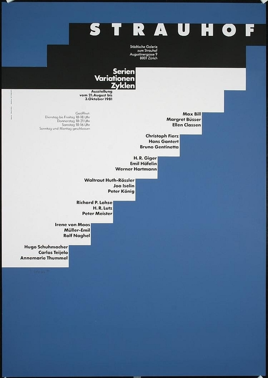

# Daily Layout No.05
*Web adaptation of a printed poster by Siegfried Odermatt*

[Click here to see the page](https://tricktrap.mx/labs/daily-layout-05/)

This is the fifth entry of Daily Layout, where I try to recreate magazine and print layouts in order to squeeze the hell out of CSS and it's limitations.

In this particular example I was able to experiment with:

+ CSS Grid, minmax, fraction units and that crazy layout
+ Clamp\(\) property for font sizes
+ Writing mode property and the way browsers render it

### Here is a copy of the original version I use for reference:

### The web version is flexible and responsive.

To mantain its flexibility i didn't use media queries on positioning, (Just a small one to hide the vertical text on mobile).

**Feel free to play around with it**

Don't forget to checkout my other repositories for more examples.

+ [Daily Layout entry #1](https://tricktrap.mx/labs/daily-layout-01/)
+ [Daily Layout entry #2](https://tricktrap.mx/labs/daily-layout-02/)
+ [Daily Layout entry #3](https://tricktrap.mx/labs/daily-layout-03/)
+ [Daily Layout entry #4](https://tricktrap.mx/labs/daily-layout-04/)
+ [Parallax illustration](https://tricktrap.mx/labs/parallax/)

### Thank you!
